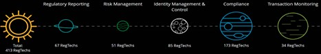

<!DOCTYPE html>
<html>
<head>
 <h1>Regulation Technology (RegTech)</h1>
 
</head>
<body>

<h3>Overview</h3>

Deloitte estimate that they are 220 regulatory revision to keep track of daily and more importantly, regulatory fines exceeding US$ 345 Billon issued since 2009. Thus, the cost of compliance is increasing substantially, and the need for companies to develop technology-based solutions are in high demand. The domain I choose is RegTech and the company is Deloitte however I focus on a Project that Deloitte explored called RegTech Universe 2021 along with their RegTech solution called RegHub.

<dl>
	<dt>Company</dt>
	<dd> -Deloitte UK</dd>
	<dt>When was the company incorporated</dt>
	<dd> -Founded in 1845</dd>
	<dt>Who are the founders of the company?</dt>
	<dd> -Founder Deepti Mohanty, Surjadinata Sumantri, William Welch Deloitte</dd>
	<dt>How did the idea for the company came about?</dt>
	<dd> -The company was founded by William welch Deloitte in London and then expanded to the United States in 1890. 
	144 years later the firm merged with Haskin & Sells in 1972 and later also merged with Touche Ross in 1989
	<dt>How is the company funded? How much funding have they received?</dt>
	<dd> -Deloitte has made 6 investments. Their most recent investment was on Nov 9, 2020, when i6 Group raised.
	      -Deloitte has had 2 exits. Deloitte's most notable exits include DataChannel and Roundarch.
	      -Deloitte has acquired 45 organizations. Their most recent acquisition was TWG on Feb 18, 2021..</dd>
</dl>
<h3>Business Activities</h3>

Deloitte provides audit, consulting, financial advisory, risk management, tax, and related services to select clients. Deloitte participating in a variety of businesses from Accounting, Advice, Consulting, Customer Service, Finance, Financial Services, Human Resources, Management Consulting, Outsourcing, Professional Services, Risk Management and Service Industry. Deloitte as an estimate of 45 acquisition and an estimate revenue range of 10B+ dollars

<strong>What specific financial problem is the company trying to solve?</strong>

Since the financial crisis of 2008, Financial services regulation has expanded at an astonish rate. The challenge is that Regulatory and Compliance as layers of complexity, this is because of the continues shifting and changing in regulatory requirements. Secondly not adherent to the regulator law and obligations has cost financial companies heavily. Complianceweek.com stated that Financial institutions have been hit with $10.4 billion in global fines and penalties related to anti-money laundering (AML), know your customer (KYC), data privacy, and MiFID (Markets in Financial Instruments Directive) <mark>regulations in 2020, bringing the total to $46.4 billion for those types of breaches since 2008.</mark>

<strong>Who is the company's intended customer? </strong>

Deloitte as many clients for instance, Metlife, Morgan Stanley, Berkshire Hathaway, The Blackstone Group, Federal National Mortgage Association, Microsoft, GM, Procter & Gamble, Apollo Global Management, Boeing. The above companies are leaders in their respective industries and are affected by regulatory challenges. “A large number of our clients are taking aggressive action to determine how they can use these technologies within their ecosystems, Krishna said. "'They’re acting as venture capitalists and investing in their internal projects to see what specific problems these technologies can solve. Some are joining different consortiums—you see this a lot with blockchain—to partner and work with the industry. Others are watching and seeing what happens next. There’s been a tremendous response within the industry.'"

<strong>Is there any information about the market size?</strong>

The global RegTech Market was estimated at USD 5.31 Billion in 2019 and is expected to reach USD 33.1 Billion by 2026. The global RegTech Market is expected to grow at a compound annual growth rate (CAGR) of 21.27% from 2019 to 2026.

<strong>What solution does this company offer that their competitors do not or cannot offer? (What is the unfair advantage they utilize?)</strong>

Deloitte advertised RegHub as an end-to-end platform for simplifying complex regulatory compliance. RegHub platform includes Horizon scanning, regulatory universe, compliance change management and compliance monitoring. Very few companies have End-to-end capability like Deloitte. 
For instance, many startup or small companies are very inspirational but not fully implementational. Meaning, they do not have the continual groundbreaking technology and financial capabilities to build a regulatory Platform like RegHub. Investopedia stated, that in 2019, the failure rate of startups was around 90%. Research concludes 21.5% of startups fail in the first year, 30% in the second year, 50% in the fifth year, and 70% in their 10th year. 
However, I feel the unfair advantage Deloitte has is the decades of knowledge that the firm has with regulatory challenges and the industry brand Deloitte Touche Tohmatsu Limited. SMB Advisor stated that Deloitte revenue went over $43 billion last year and named #1 ranked accounting firm by Inside Public Accounting in 2017 as well as #1 in consulting based on revenue by Gartner. More importantly, Deloitte Consulting provides audit, financial advisory, legal, management, risk advisory, and tax consulting services to nearly 90 percent of the Fortune 500.
<b>The link below demonstrates a real-life regulatory challenges and Deloitte’s services and  solutions:</b>
<a href="https://www2.deloitte.com/content/dam/Deloitte/sg/Documents/financial-services/sg-fsi-regtech-brochure.pdf">Deloitte Solutions</a>

<strong>Which technologies are they currently using, and how are they implementing them? </strong>

Emerging technologies such as artificial intelligence (AI), machine learning, big data analytics, distributed ledger technology, and the Internet of Things (IoT), are disrupting traditional business models. In the wake of these developments, regulatory leaders are faced with a key challenge: how to best protect citizens, ensure fair markets, and enforce regulations, while allowing these new technologies and businesses to flourish?

<strong>What domain of the financial industry is the company in?</strong>

Deloitte is the brand under which tens of thousands of dedicated professionals in independent firms throughout the world collaborate to provide audit & assurance, consulting, financial advisory, risk advisory, tax, and related services to select clients.

<strong>What have been the major trends and innovations of this domain over the last 5-10 years?</strong>

need better answer

<strong>What are the other major companies in this domain?</strong>

Regarding RegTech, Deloitte has help firms to automate the more mundane compliance tasks and reduce operational risks associate with meeting compliance and reporting obligations. NEW YORK, NY, USA, 25 May 2017 — Deloitte announced today that ALM Intelligence has named it as a global leader in Regulatory Compliance Program Consulting. In the report, entitled Regulatory Compliance Program Consulting 2017, ALM Intelligence highlights, “Deloitte is on the forefront of helping clients evolve and elevate the role of the chief compliance officer (CCO) and the compliance function in advancing the enterprise-wide strategic goals and business objectives through the development of deeper integration and alignment between compliance and its internal and external stakeholders.”

“Deloitte’s longstanding position as the global leader in regulatory compliance consulting has been reconfirmed in this latest report from ALM,” said Sam Balaji, Deloitte Global Risk Advisory Leader. “The extensive depth and breadth of our regulatory consulting capabilities puts Deloitte in a unique position to help Deloitte clients address their most complex regulatory challenges and to leverage regulatory risk as a source of competitive advantage.”

According to ALM, Regulatory Compliance “refers to the formal operating and reporting processes designed to provide reasonable assurance that an organization is adhering to applicable internal and external policies, procedures, standards, laws, and regulations. The goal of regulatory compliance program consulting is to help clients create suitable, sustainable, and repeatable processes, supported by appropriate organizational structures and enabling systems & analytics, to address existing and evolving regulatory requirements and obligations.”

“The recognition by ALM of our #1 rank in both client impact and breadth of capabilities is a clear testament to how highly our clients value our advice on practical compliance with laws and regulations, as well as our insights on how to transform compliance by leveraging technology and innovative solutions,” said Henry Ristuccia, Regulatory Risk Leader, Deloitte Global Risk Advisory.

<strong>What are some of the core metrics that companies in this domain use to measure success? How is your company performing, based on these metrics?</strong>

need answers

<strong>Recommendations</strong>

Deloitte (RegTech Universe 2021) analyzed more than 360 companies, identifying 5 main categories in RegTech. Compliance represents 41% of regularity subject area, likewise, Risk Management 14%, Identity Management and Control 23%, Regularity Reporting 14% Transaction Monitoring 8%. These categories depend on the optimization of their technology to define changes and move from complexity to (efficiency, transparency, respect) clarity. The RegTech Universe 2021 study found in total 413 RegTech solutions. For instance, Regulatory Reporting had 67 RegTech solution that Enable automated data distribution and regulatory reporting through big data analytics, real time reporting and cloud. Risk Management 51 RegTech solution, Identity management & control 85 RegTech solutions, Compliance has 173 RegTech solutions and Transaction Monitor 34 RegTech solution. I concluded from the RegTech Universe 2021 study that not one company can solve all regularity challenges especially if your company have limited finance.

</body>
</html>